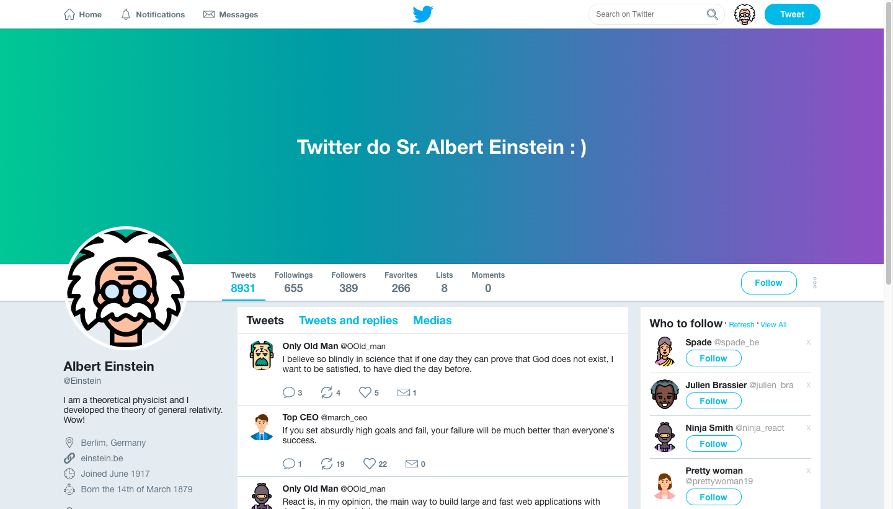

## Projeto da Página Profile do Twitter - Versão 2019

Projeto clone da página de Profile do Twitter utilizando o Flexbox CSS. Um curso bônus da Rocketseat GoStack.

  

### Aplicação 100% desenvolvida com HTML, CSS e Flexbox:

  https://www.w3schools.com/css/css3_flexbox.asp

### Conheça melhor o meu trabalho!

  https://www.linkedin.com/in/alexgomesnet/

### License:

  [MIT](LICENSE)